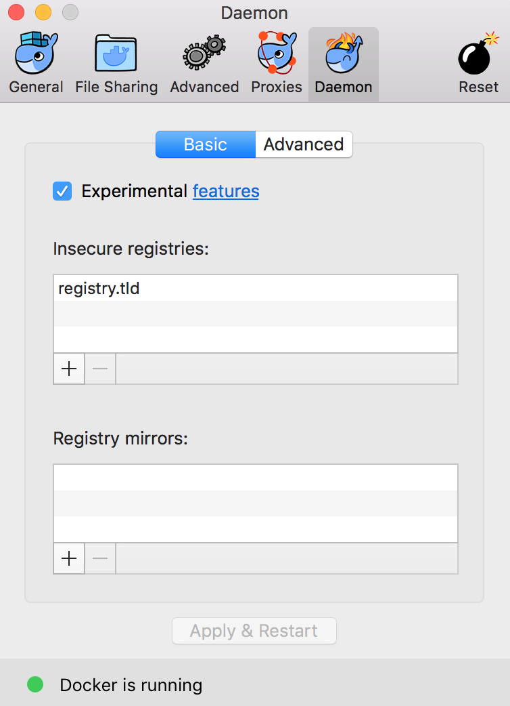

# conjur-registry-proxy

Use conjur-asset-proxy to access a Conjur-protected Docker registry.

# Configuration

## `/etc/hosts`

For historical reasons, the name of Conjur's Docker registry is `registry.tld`. Add this name as an alias to localhost in your `/etc/hosts` file (for example, by running `sudo vi /etc/hosts`). It should look like this when you are done:

```sh-session
$ cat /etc/hosts | grep registry.tld
127.0.0.1       registry.tld
```

## Docker for Mac

Next, add `registry.tld` as an "insecure registry" to your Docker for Mac configuration:



Note: This does not actually make the registry insecure, because all the "insecure" (non-HTTTPS) traffic is happening inside your local machine.

# Run

You must first use `conjur init` to connect to the Conjur server protecting the registry.

```
$ ./run.sh
```

# Use

Run as above, the proxy listens on port 80 for requests to forward. If you reference your Docker registry by name (e.g. `registry.tld`), you'll need to add an entry to `/etc/hosts`:

```
127.0.0.1	registry.tld
```

Then, you can access your registry through the proxy

```
$ docker search registry.tld/conjur-appliance
NAME                                      DESCRIPTION   STARS     OFFICIAL   AUTOMATED
library/conjur-appliance                                0
```
